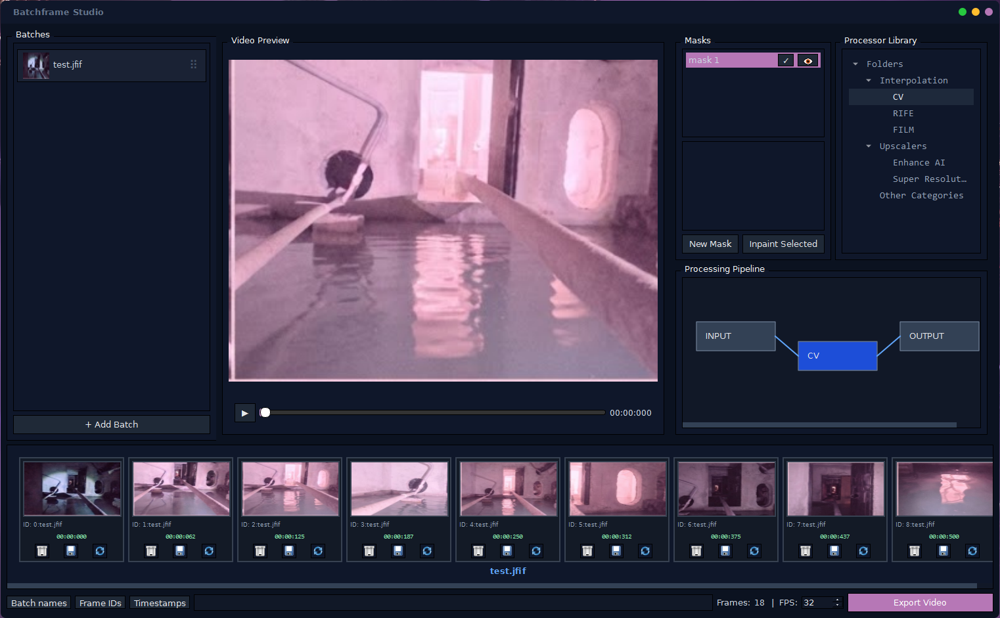
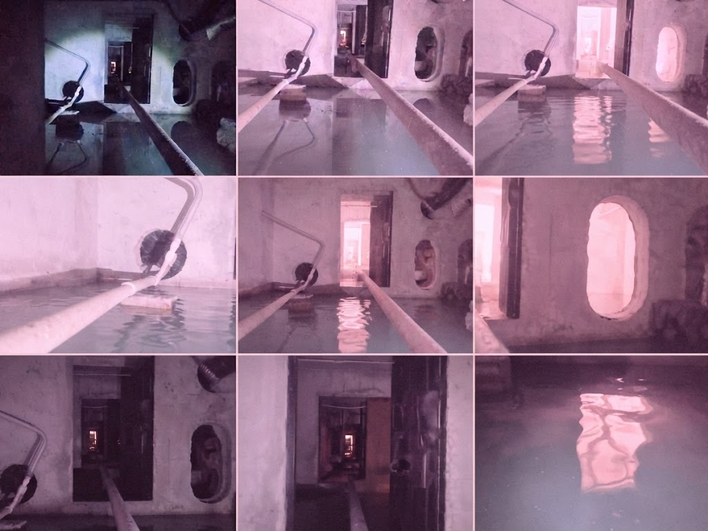

# matrix2videoflow

**matrix2videoflow** – desktop-видеоредактор на Python для создания покадровой анимации из матриц кадров.

Проект принимает изображения, содержащие матрицы кадров анимации, извлекает отдельные кадры и последовательно склеивает их в видео. Дополнительно предоставляет инструменты для интерполяции кадров, inpaint областей изображения и построения цепочек эффектов через node editor.



## Что делает проект

Типовой сценарий выглядит так:

```text
Матрица кадров
      ↓
Извлечение отдельных кадров
      ↓
Обработка / редактирование
      ↓
Интерполяция кадров
      ↓
Цепочка эффектов
      ↓
Сборка последовательности
      ↓
Видео
```

Входное изображение может содержать:

* 4 кадра;
* 9 кадров;
* 16 кадров.

Каждый кадр извлекается из матрицы и далее обрабатывается как отдельное изображение.

## Пример входных данных

Входной файл представляет собой одно изображение, внутри которого расположена матрица кадров от 2х2 до 4х4.

Программа может принимать несколько таких матриц.

Например:



## Интерполяция кадров

Для увеличения плавности анимации проект поддерживает интерполяцию промежуточных кадров.

На данный момент могут использоваться:

* OpenCV;
* Google FILM.

Это позволяет получать более плавное движение без необходимости вручную создавать каждый промежуточный кадр.

## Mask Inpaint

Для локального редактирования кадров используется mask-based inpainting.

Пользователь задаёт область изображения маской, после чего выбранная область перегенерируется с использованием LLaMA.

Такой подход позволяет удалять или изменять отдельные элементы кадров, не перерабатывая весь кадр. Например, подходит для удаления вотермарок.

## Node Editor

Для построения цепочек обработки используется node editor.

Каждый node представляет отдельный этап обработки изображения или эффект.

Граф позволяет собирать различные pipeline без жёстко заданной последовательности операций.

Это также делает архитектуру проекта расширяемой: новый эффект может быть представлен отдельным node и подключён к существующему pipeline.

## Технологический стек

| Технология  | Назначение                    |
| ----------- | ----------------------------- |
| Python      | Основной язык проекта         |
| PyQt6       | Desktop GUI                   |
| OpenCV      | Обработка изображений и видео |
| TensorFlow  | ML-компоненты                 |
| Google FILM | Интерполяция кадров           |
| LLaMA       | Inpainting                    |

---

## Автор

**duvean**

[GitHub](https://github.com/duvean)
